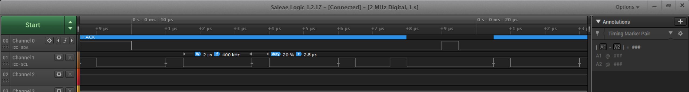
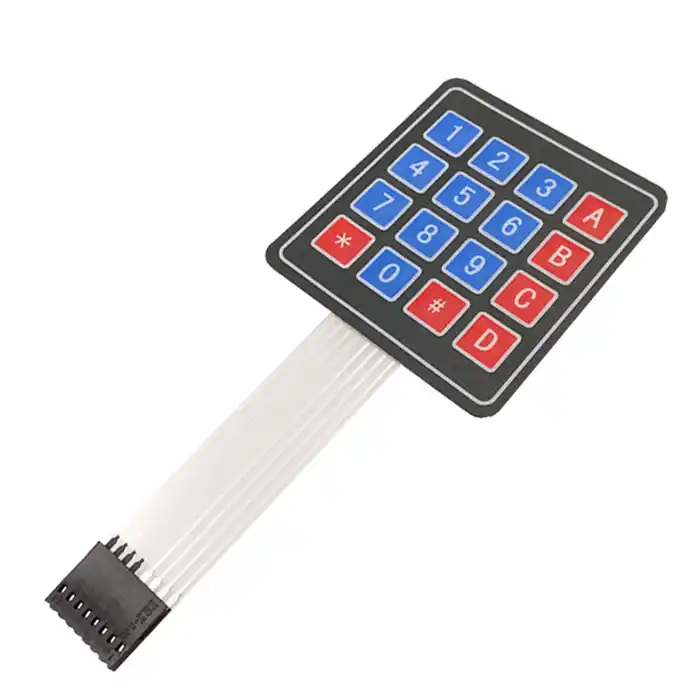

# STM32L431RC6-hal
使用STM32HAL库编写，尝试通用架构，想多芯片之间移植

### 实现模块：
#### 1. 串口 
    支持STM32所有硬件串口，支持输出重定向
    该课程出版社提供的板子使用的是USART2
#### 2. 板级驱动
    定义了该开发板的按键，LED灯
    按键支持中断
    LED灯支持PWM
#### 3. 定时器 
    完成高级定时器，通用定时器，基本定时器的封装
    提供更新中断，输入捕获(误差在1us内)，PWM波形输出(误差在10us内)
#### 4. 看门狗 
    支持独立看门狗和窗口看门狗

### 硬件支持: 
#### 1. OLED显示屏 
    OLED显示屏支持硬件IIC，软件IIC，支持显存，支持输出重定向。
    软件IIC最大支持速率200kHz

  

  <video width="200" controls>
    <source src="./markdown/video/OLED_Game.mp4" type="video/mp4">
    您的浏览器不支持视频播放。
  </video>

 

#### 2.矩阵键盘
    使用软件逐行列扫描

  

    (这里如果使用外部触发会因为终端号使用过多,容易造成冲突,并且使用中断对应按键的处理逻辑也要单独实现,过于麻烦,会冗余,因此没有实现外部触发)