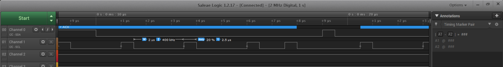
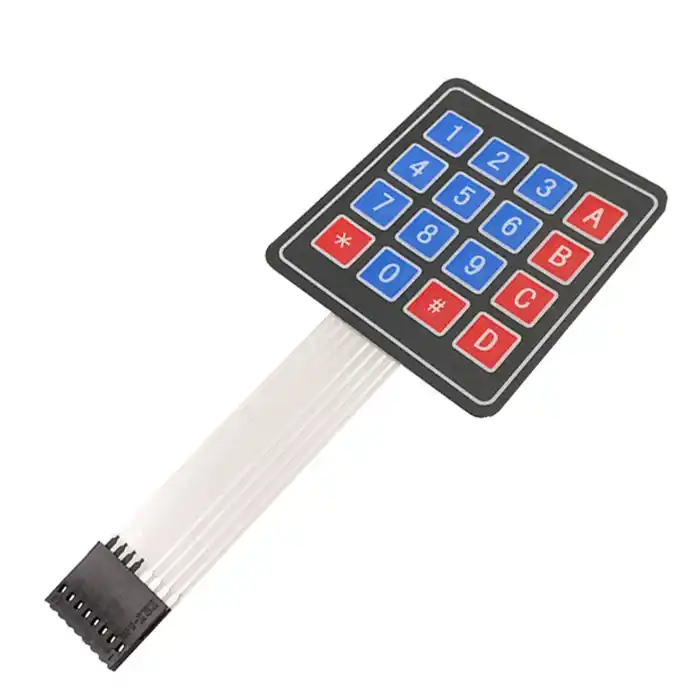
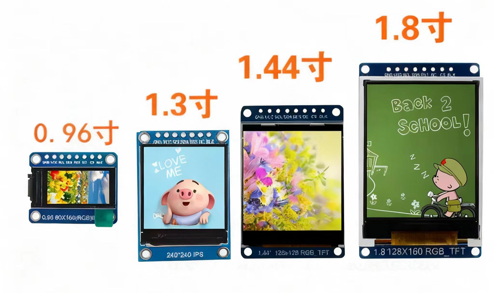

# STM32L431RC6-hal
使用STM32HAL库编写，尝试通用架构，想多芯片之间移植。

### 开发环境: 
支持VScode使用Embedded IEE开发，如何配置VScode环境请参考
https://www.bilibili.com/video/BV1nr4y1R7Jb?vd_source=c9e40c724e57541ae5cd544e79f91694 

如果使用Keil5开发，请点击STM32L431RCT6_HAL\MDK-ARM\Project.uvprojx，用keil打开
Keil5烧录后需要按一下RST按键，将芯片复位
已经移植FreeRTOS,请注意该项目的基本时钟源用的TIM7,来给滴答定时器计数,不可再使用TIM7,如需使用请更改为其他定时器

```c
//port.c
/*-----------------------------------------------------------*/
/*
 * Setup the SysTick timer to generate the tick interrupts at the required
 * frequency.
 */
#if( configOVERRIDE_DEFAULT_TICK_CONFIGURATION == 0 )

	__weak void vPortSetupTimerInterrupt( void )
	{
		/* Calculate the constants required to configure the tick interrupt. */
		#if( configUSE_TICKLESS_IDLE == 1 )
		{
			ulTimerCountsForOneTick = ( configSYSTICK_CLOCK_HZ / configTICK_RATE_HZ );
			xMaximumPossibleSuppressedTicks = portMAX_24_BIT_NUMBER / ulTimerCountsForOneTick;
			ulStoppedTimerCompensation = portMISSED_COUNTS_FACTOR / ( configCPU_CLOCK_HZ / configSYSTICK_CLOCK_HZ );
		}
		#endif /* configUSE_TICKLESS_IDLE */

		/* Stop and clear the SysTick. */
		portNVIC_SYSTICK_CTRL_REG = 0UL;
		portNVIC_SYSTICK_CURRENT_VALUE_REG = 0UL;

		/* Configure SysTick to interrupt at the requested rate. */
		portNVIC_SYSTICK_LOAD_REG = ( configSYSTICK_CLOCK_HZ / configTICK_RATE_HZ ) - 1UL;
		portNVIC_SYSTICK_CTRL_REG = ( portNVIC_SYSTICK_CLK_BIT | portNVIC_SYSTICK_INT_BIT | portNVIC_SYSTICK_ENABLE_BIT );
	}

#endif /* configOVERRIDE_DEFAULT_TICK_CONFIGURATION */
/*-----------------------------------------------------------*/

//timer.c

/**
 * @brief       定时器更新中断回调函数
 * @param       htim:定时器句柄
 * @retval      无
 */
void HAL_TIM_PeriodElapsedCallback(TIM_HandleTypeDef *htim)
{
    // warning: 该定时器用于在FreeRTOS下实现时钟节拍，不可再使用
    // 不要删除此段代码，否则FreeRTOS无法正常运行
    if (htim->Instance == TIM7) {
        // FreeRTOS的时钟节拍
        HAL_IncTick();
    }
}

```

### 实现模块：

| 编号 | 模块名称 | 功能描述 |
|------|----------|----------|
| 1 | 串口 | 支持STM32所有硬件串口，支持输出重定向，该课程出版社提供的板子使用的是USART2 |
| 2 | 板级驱动 | 定义了该开发板的按键，LED灯；按键支持中断；LED灯支持PWM |
| 3 | 定时器 | 完成高级定时器，通用定时器，基本定时器的封装；提供更新中断，输入捕获(误差在1us内)，PWM波形输出(误差在10us内) |
| 4 | RTC实时时钟 | 支持RTC时钟，支持闹钟，支持中断；读写后备寄存器设置时钟源, 默认外部低速时钟, 如果起振失败，则使用内部低速时钟 (当BKP0==0X5050时,使用的是LSE, 当BKP0==0X5051时,使用的是LSI) |
| 5 | RNG硬件真随机数 | 硬件外设真随机数生成器 |
| 6 | 看门狗 | 支持独立看门狗和窗口看门狗 |
| 7 | 电源管理 | PVD电压监视器；STM32 运行模式切换 (睡眠模式，停止模式，待机模式) |
| 8 | DMA直接内存访问 | 内存到内存DMA传输，提供同步和异步两种传输方式, 支持中断方式传输，提高CPU利用率；实现USART DMA发送和接收功能 |
| 9 | ADC模数转换器 | 支持STM32L431RCT6的12位ADC外设；支持单通道和多通道ADC采集；提供可变参数列表方式配置ADC通道；支持DMA和中断两种数据接收模式；提供电压值计算和平均值滤波功能 |
| 10 | DAC模数转换器 | 支持STM32L431RCT6的12位DAC外设；支持PA4和PA5两个通道；提供独立函数设置电压输出；支持软件触发模式 |


### 硬件支持: 
#### 1. OLED显示屏 
OLED显示屏支持硬件IIC，软件IIC，支持显存，支持输出重定向。
软件IIC最大支持速率400kHz
<p align="center">
  
</p>
<p align="center">
  <video width="200" controls>
    <source src="./markdown/video/OLED_Game.mp4" type="video/mp4">
    您的浏览器不支持视频播放。
  </video>
</p> 

#### 2.矩阵键盘
使用软件逐行列扫描
<p align="center">
  
</p>
    (这里如果使用外部触发会因为终端号使用过多,容易造成冲突,并且使用中断对应按键的处理逻辑也要单独实现,过于麻烦,会冗余,因此没有实现外部触发)

#### 3. TFT彩屏 
TFT彩屏使用软件SPI，可快速定义引脚。支持显存。
四种字体，任意颜色，可指定起始像数位置。显示图片，实时绘制3D几何图形，播放视频。支持输出重定向。
(采用画点函数实现)

<p align="center">
  
</p>